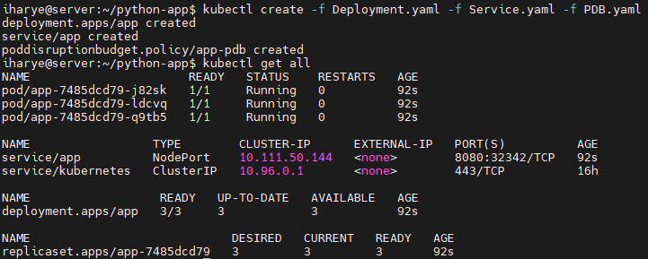
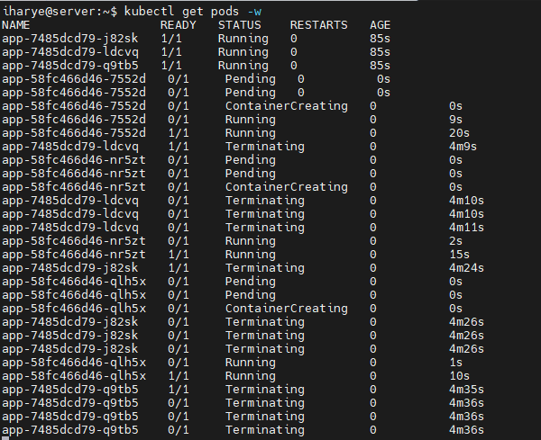
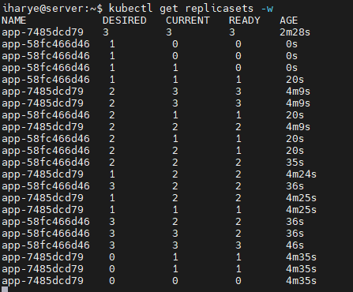
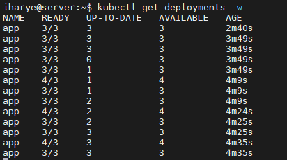
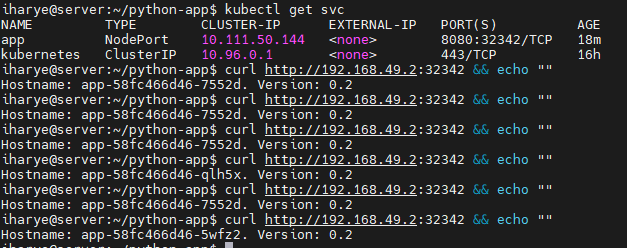
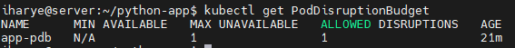

# Lab: containerizing and deploying application into K8S cluster 
## 1. Build docker image with Python  application
**[Check out Dockerfile](https://github.com/AvaTTaR/python-app/blob/main/Dockerfile "Check out Dockerfile")**

Build docker image with command `docker build --tag=avattar/wa3:v3 . `

`docker login` and push it to DockerHub using `docker push avattar/wa3:v3` 


---

## 2. Setup K8S cluster using Minikube(1 master + 1 worker node is enough)

Install minikube from binary

```
curl -LO https://storage.googleapis.com/minikube/releases/latest/minikube-linux-amd64
sudo install minikube-linux-amd64 /usr/local/bin/minikube
rm minikube-linux-amd64 #clean downloaded binary
```

Install kubectl. As we are using minikube, we also can just create alias `alias kubectl="minikube kubectl --"`

```
curl -LO https://storage.googleapis.com/kubernetes-release/release/v1.22.0/bin/linux/amd64/kubectl
chmod +x ./kubectl
sudo mv ./kubectl /usr/local/bin/kubectl
```

Create and start cluster with 2 nodes:
```
minikube start --nodes 2
```

## 3. Deploy the application into the K8S cluster

**[Deployment.yaml](https://github.com/AvaTTaR/python-app/blob/main/Deployment.yaml "Check out Deployment.yaml")**





---

## The deployment requires 3 replicas, “RollingUpdate” strategy. 
#### Define the liveness and readiness probes to /health endpoint and 8080 port, resources(requests/limits) 

All is in **[Deployment.yaml](https://github.com/AvaTTaR/python-app/blob/main/Deployment.yaml "Check out Deployment.yaml")** requests/limits set to follow burstable strategy. 

#### Emulate the “RollingUpdate” strategy by updating docker image. Provide screenshots. 

We can update image by changing it in the yaml and apply it using kubectl or use command ( Current image is **avattar/wa3:v2noexp** and we changing it to **avattar/wa3:v3** )
```
kubectl set image deploy app wa3=avattar/wa3:v3
```







### Logs from pods:

**[Pod1.log](https://github.com/AvaTTaR/python-app/blob/main/Week3_Docker_Kubernetes/pod1.log "Check out pod1.log")**

**[Pod2.log](https://github.com/AvaTTaR/python-app/blob/main/Week3_Docker_Kubernetes/pod1.log "Check out pod1.log")**

**[Pod3.log](https://github.com/AvaTTaR/python-app/blob/main/Week3_Docker_Kubernetes/pod1.log "Check out pod1.log")**


## Create a “Service” object which exposes Pods with application outside the K8S cluster in order to access each of the replicas through the single IP address/DNS name.

**[Service.yaml](https://github.com/AvaTTaR/python-app/blob/main/Service.yaml "Check out Service.yaml")**



## Specify PodDistruptionBudget which defines that only 1 replica can be down. 

**[PDB.yaml](https://github.com/AvaTTaR/python-app/blob/main/PDB.yaml "Check out PDB.yaml")**


